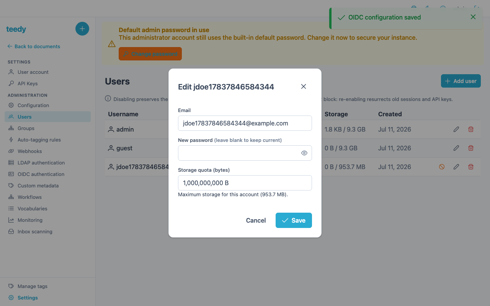
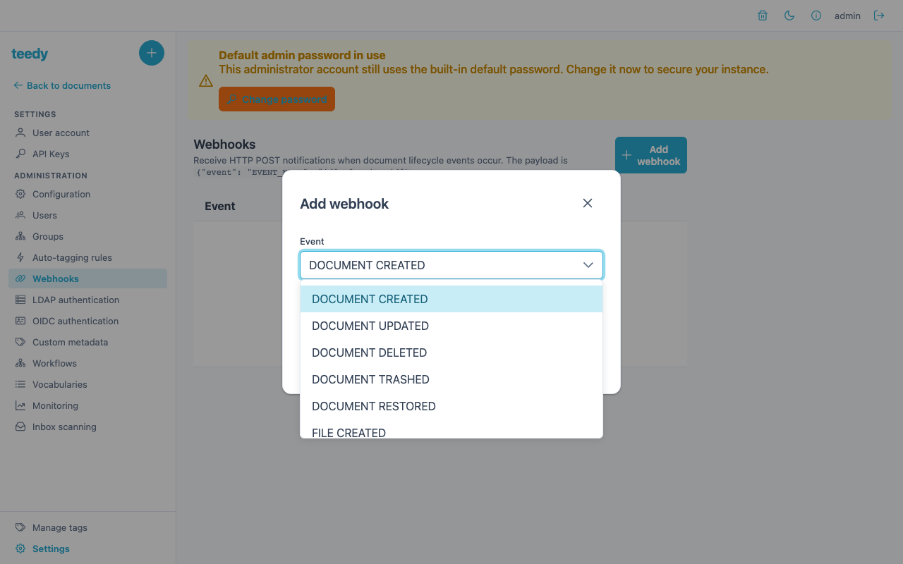
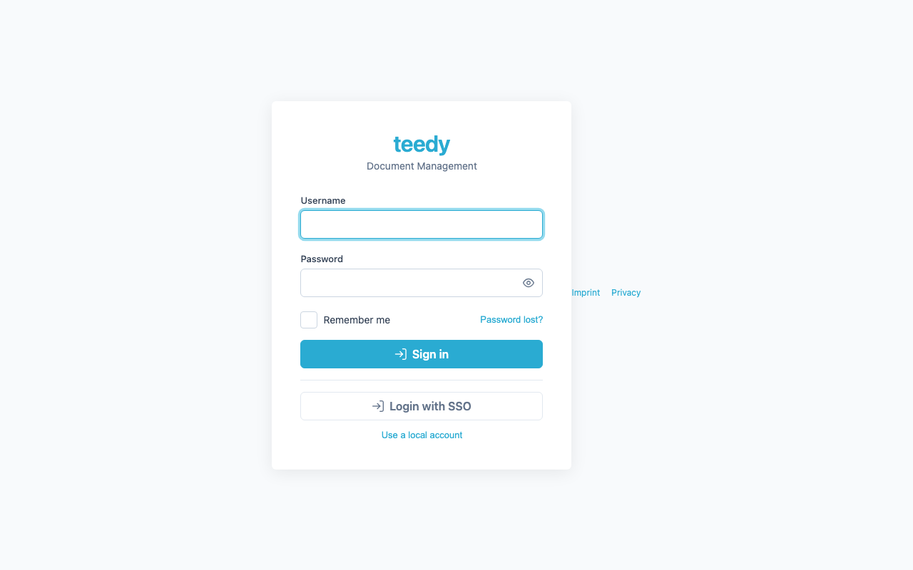

# Admin guide

This page covers the administrator-only capabilities: user and quota management,
webhooks, auto-tagging rules, the audit log, custom theming, and the SMTP/OCR
settings that live in the server configuration.

Most admin features live under **Settings** when you are logged in as an
administrator. A few (theme, SMTP, OCR) are API- or environment-only and are noted
as such.

## Users and quotas

Manage users in **Settings → Users**. The user list shows each user's storage
usage against their quota, and you can create, edit, disable/re-enable, and delete
users. The create and edit dialogs expose a **quota** field (in bytes) for setting a
per-user storage limit.

| Action | Request |
|--------|---------|
| List users | `GET /api/user` |
| Create a user | `PUT /api/user` with form params `username`, `password`, `email`, `storage_quota` |
| Get a user | `GET /api/user/{username}` |
| Delete a user | `DELETE /api/user/{username}` |

- **`storage_quota`** is a per-user byte limit; the user list displays used-vs-quota
  for each account. The `DOCS_GLOBAL_QUOTA`
  [environment variable](configuration.md#general) both caps the *total* storage across
  all users and seeds the default per-user quota for auto-provisioned accounts. The
  global total counts physical bytes retained on disk — including files kept live for
  soft-deleted (ghost) users after a reassign-delete — not just the active users' counters.
- **Disable / re-enable** lets you block a user without deleting their documents.
  Disabled accounts are refused at *every* auth path — local login, session cookie,
  API key, OIDC, and LDAP.
- **Password reset** for a user with no email configured is done here (Settings →
  Users → edit → set password); see [RECOVERY.md](../RECOVERY.md).

## Webhooks

Webhooks POST a JSON payload to an external URL when something happens in Teedy —
useful for wiring Teedy into automations. Manage them in **Settings → Webhooks**
(admin only).

| Action | Request |
|--------|---------|
| List webhooks | `GET /api/webhook` |
| Create a webhook | `PUT /api/webhook` with form params `event`, `url` |
| Delete a webhook | `DELETE /api/webhook/{id}` |

The full set of events you can subscribe to:

| Event | Fires when |
|-------|-----------|
| `DOCUMENT_CREATED` | A document is created |
| `DOCUMENT_UPDATED` | A document is updated |
| `DOCUMENT_DELETED` | A document is permanently deleted |
| `DOCUMENT_TRASHED` | A document is moved to the trash |
| `DOCUMENT_RESTORED` | A document is restored from the trash |
| `FILE_CREATED` | A file is added |
| `FILE_UPDATED` | A file is updated |
| `FILE_DELETED` | A file is deleted |
| `ROUTE_STARTED` | A [workflow route](workflows.md) is started |
| `ROUTE_STEP_TRANSITIONED` | A route step is validated, approved, or rejected |
| `ROUTE_COMPLETED` | A route finishes |

By default Teedy refuses webhook URLs that point at private, loopback, or
link-local addresses (SSRF protection). To allow them (e.g. an internal automation
host), set `DOCS_WEBHOOK_ALLOW_PRIVATE=true`.

## Tag-match rules (auto-tagging)

Rules that automatically apply a tag to documents matching a title, filename, or
content pattern are administered in **Settings → Tag Rules**. See
[tags & filtering](tags-and-filtering.md#auto-tagging-tag-match-rules) for the rule
fields and API.

## Audit log

Every significant change (document/file/user create-update-delete, ACL changes) is
recorded. View it via `GET /api/auditlog` (admin only), with optional `limit`,
`offset`, and sort parameters. Each entry records the action type, the affected
entity, a message, the timestamp, and the acting user.

## Statistics dashboard

Admins get a global usage dashboard at **Settings → Statistics** (backed by
`GET /api/app/stats?window=` — admin only, `window` is one of `7`, `30`, `90` days;
any other value is a `400`). It is a read-only snapshot with a manual refresh and window
selector — there is no auto-refresh.

- **Totals** — documents (non-deleted), files (non-deleted rows **including historical
  versions**, so it is higher than the document count), users (non-deleted, **including
  disabled** ones, which still hold storage), tags (non-deleted), and favorites (a raw
  aggregate row count — no per-user favorite visibility, consistent with favorites being
  private).
- **Documents by creation date** — a daily series bucketed on each document's recorded
  create date (which is client-suppliable/backdatable), not on audit events.
- **Activity** — a daily series counting retained audit-log entries for documents, files,
  comments, routes, and tags across all create/update/delete actions.
- **Storage by user** — global usage plus the top 10 users by current storage
  (descending, ties broken by username).

All day buckets are UTC `[start, end)` calendar days and are zero-filled across the window.

> **Caveat — activity reflects RETAINED audit rows only.** The storage-cleanup job
> (`POST /api/app/batch/clean_storage`) hard-deletes "orphan" audit logs. Because that
> query does not join the route table, route audit entries are purged wholesale, so the
> activity series undercounts route activity after a cleanup run. This is a known
> pre-existing limitation, tracked separately.

## Theming (API-only)

Teedy's appearance is customized through a custom-CSS injection endpoint — there is
**no dedicated theme settings page** in the UI; it is an admin API capability.

| Action | Request |
|--------|---------|
| Get the theme config | `GET /api/theme` |
| Update the theme | `POST /api/theme` with form params `name`, `color`, `css` (admin) |
| Get the compiled stylesheet | `GET /api/theme/stylesheet` |
| Upload a logo/background image | `PUT /api/theme/image/{type}` (`type` = `logo` or `background`, admin) |

- `name` — the application name shown in the UI (3–30 chars).
- `color` — a hex accent color applied to the navbar (default `#ffffff`).
- `css` — arbitrary custom CSS appended to the generated stylesheet.

## Footer links

Self-hosted and organizational deployments often need imprint, privacy, terms, or
documentation links reachable from the application — common EU compliance
requirements. An admin can configure up to five label-and-URL pairs that render in
the application footer (desktop and mobile) and, because they are public chrome,
on the login screen before authentication.

| Action | Request |
|--------|---------|
| Read the configured links | `GET /api/app` → the `footer_links` array (anonymous) |
| Set the links | `POST /api/app/footer_links` with form param `links` — a JSON array of `{label, url}` objects (admin) |

- Each entry is a `{ "label": "…", "url": "…" }` pair; up to five entries.
- `label` — free text, up to 40 characters.
- `url` — must be an absolute `http(s)` URL (up to 500 chars); other schemes such
  as `javascript:` or `data:` are rejected.
- An empty list clears the footer (the default — nothing renders).

Links open in a new tab with `rel="noopener noreferrer"`.

## SMTP and OCR

These are configured through the server environment, not a settings page:

- **SMTP** — set `DOCS_SMTP_HOSTNAME`, `DOCS_SMTP_PORT`, `DOCS_SMTP_USERNAME`,
  `DOCS_SMTP_PASSWORD`, `DOCS_SMTP_FROM` (see
  [configuration](configuration.md#e-mail-smtp)). SMTP is used for password-reset
  emails and workflow-rejection notifications. Remember: a relay `250` is
  acceptance, not delivery — verify inbox receipt.
- **OCR** — the default OCR language is set with `DOCS_DEFAULT_LANGUAGE` (see
  [configuration](configuration.md#language--ocr)). The Docker image bundles
  Tesseract; OCR runs automatically on uploaded images and PDFs.

## See also

- [Configuration](configuration.md) — every environment variable and `-D` property
- [Authentication](authentication.md) — OIDC / LDAP / proxy-auth setup
- [Workflows](workflows.md) — the route events webhooks fire on
- [RECOVERY.md](../RECOVERY.md) — account and admin recovery
