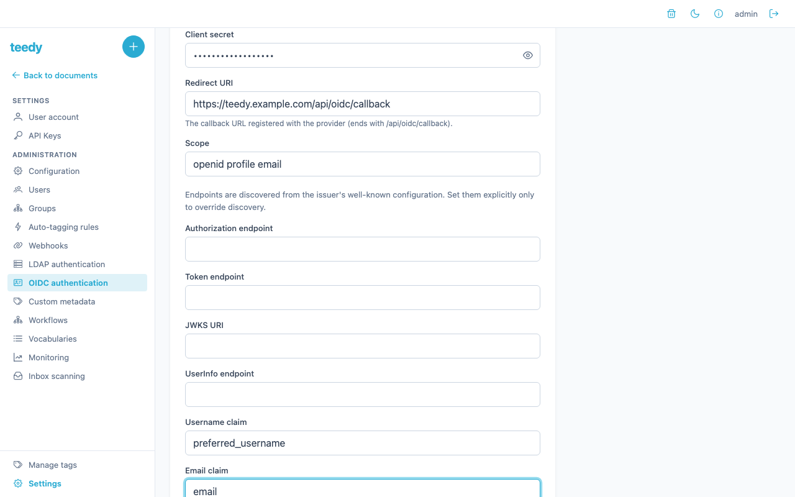
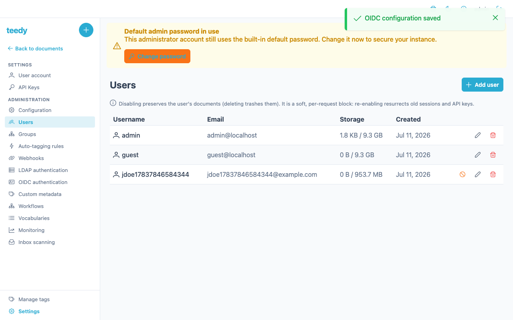

# Authentication

Teedy can authenticate users four different ways, and more than one can be active
at once. This page covers each flow, how accounts are provisioned, and how to
diagnose a login that fails.

| Flow | Identity owner | Provisioning | Use it for |
|------|----------------|--------------|------------|
| **Local login** | Teedy (bcrypt password) | Admin creates the user | The built-in `admin`, small teams, break-glass access |
| **OIDC / SSO** | An OIDC provider (Authelia, Keycloak, Authentik…) | Auto-provisioned on first login | Proper per-user SSO for browser sessions |
| **Header / proxy auth** | A trusted reverse proxy (oauth2-proxy, Authelia forward-auth) | Never — existing users only | API access / a proxy that already authenticated the request |
| **LDAP** | An LDAP directory | Auto-provisioned on first successful bind | An existing corporate directory |

The built-in `admin` account always authenticates against the **local database**
and is deliberately never authenticated through OIDC, the proxy header, or an LDAP
bind. That makes it a reliable break-glass path: a misconfigured or down SSO
provider can never lock you out of admin.

## 1. Local login

Local users have a bcrypt password stored in Teedy and sign in with a username and
password on the login form. Admins create local users in **Settings → Users** and
can reset any user's password there.

The initial `admin` account has the password `admin` — **change it before going to
production** (Settings → Account, or by editing the user in Settings → Users). See
[getting started](getting-started.md#first-login) for first-login steps and
[configuration](configuration.md) for the login-hardening variables
(`DOCS_LOGIN_MAX_ATTEMPTS`, `DOCS_LOGIN_LOCKOUT_SECONDS`, `DOCS_BCRYPT_WORK`).

For password recovery — with or without SMTP — see [RECOVERY.md](../RECOVERY.md).

## 2. OIDC / SSO

Teedy has a built-in OpenID Connect client using the Authorization Code flow with
PKCE and a confidential client. It works with Authelia, Keycloak, Authentik, or any
standards-compliant provider.


### Configuration

OIDC settings are read as JVM **system properties**, passed via `JAVA_TOOL_OPTIONS`
(for example `-Ddocs.oidc_enabled=true`):

| Property | Required | Description |
|----------|----------|-------------|
| `docs.oidc_enabled` | Yes | Set to `true` to enable OIDC |
| `docs.oidc_issuer` | Yes | Issuer URL (e.g. `https://auth.example.com`) |
| `docs.oidc_client_id` | Yes | OIDC client ID |
| `docs.oidc_client_secret` | Yes | OIDC client secret (plaintext) |
| `docs.oidc_redirect_uri` | Yes | Callback URL (e.g. `https://teedy.example.com/api/oidc/callback`) |
| `docs.oidc_scope` | No | Scopes to request (default `openid profile email`) |
| `docs.oidc_authorization_endpoint` | No | Override the authorization endpoint (see Docker networking below) |
| `docs.oidc_token_endpoint` | No | Override the token endpoint (see Docker networking below) |
| `docs.oidc_jwks_uri` | No | Override the JWKS URI (see Docker networking below) |
| `docs.oidc_userinfo_endpoint` | No | Override the UserInfo endpoint. Consulted only when a configured claim is missing from the ID token. |
| `docs.oidc_username_claim` | No | Claim used to derive the local username at provisioning (default `preferred_username`) |
| `docs.oidc_email_claim` | No | Claim used for the user's email at provisioning and profile refresh (default `email`) |

The same settings can also be managed from the admin UI at **Settings → OIDC
authentication** (a DB-backed configuration overrides the system properties without a
restart). The client secret is entered as a masked field and is write-only — it is
never returned to the browser.



### How the flow works

1. The user clicks **Login with SSO** (or navigates to `/api/oidc/login`).
2. Teedy redirects to the provider's authorization endpoint with a PKCE challenge,
   `state`, and `nonce`.
3. After the user authenticates, the provider redirects back to
   `/api/oidc/callback`.
4. Teedy consumes the single-use `state`, exchanges the code for tokens (with the
   PKCE verifier), verifies the ID-token signature (RSA via JWKS), and validates
   issuer, audience, and nonce.
5. Claims are resolved from the ID token, falling back to the UserInfo endpoint
   when a configured claim is missing (the UserInfo `sub` must match the ID-token
   `sub`).
6. The account is looked up (or provisioned) by its `(issuer, sub)` binding, the
   disabled-account gate is applied, and a session cookie is minted.

### Provisioning contract

Understanding how OIDC accounts are created prevents surprises:

- **`sub` is the only identity key.** Login requires a `sub` claim; a token without
  one is rejected. The stored binding is `(issuer, sub)`, enforced unique in the
  database, so repeated logins with the same identity always converge on the same
  single account — even under concurrent first logins.
- **Teedy never links to an existing account by username or email.** Doing so would
  allow account takeover, so the first login for a given `sub` always provisions a
  **brand-new** user with the `user` role.
- **Claims affect profile data, never account linking.** `docs.oidc_username_claim`
  (default `preferred_username`) is sanitized to Teedy's username charset and
  suffixed with a deterministic hash of the identity, so two providers/subjects
  that share a display name never collide. `docs.oidc_email_claim` (default `email`)
  sets the address at provisioning and refreshes it on later logins — but a
  temporarily absent or invalid email claim never overwrites a stored address.
- **UserInfo is the supported claim source for minimal-ID-token providers.** When a
  configured claim is absent from the ID token (default Authelia ≥ 4.38 ships a
  minimal ID token), Teedy fetches the UserInfo endpoint with the access token and
  verifies the returned `sub` exactly matches the ID-token `sub` before consuming
  any claim.



### Docker networking (split endpoints)

Inside a container Teedy often cannot resolve the external issuer URL. Split the
browser-facing authorization endpoint from the server-to-server token/JWKS/UserInfo
endpoints with explicit overrides:

```yaml
JAVA_TOOL_OPTIONS: >-
  -Ddocs.oidc_enabled=true
  -Ddocs.oidc_issuer=https://auth.example.com
  -Ddocs.oidc_client_id=teedy
  -Ddocs.oidc_client_secret=your-secret-here
  -Ddocs.oidc_redirect_uri=https://teedy.example.com/api/oidc/callback
  -Ddocs.oidc_authorization_endpoint=https://auth.example.com/api/oidc/authorization
  -Ddocs.oidc_token_endpoint=http://authelia:9091/api/oidc/token
  -Ddocs.oidc_jwks_uri=http://authelia:9091/jwks.json
  -Ddocs.oidc_userinfo_endpoint=http://authelia:9091/api/oidc/userinfo
```

The authorization endpoint uses the external URL (browser redirect); the token,
JWKS, and UserInfo endpoints use internal Docker DNS (server-to-server). The
UserInfo endpoint is only contacted when a configured claim is missing from the ID
token.

### Authelia provider setup

With Authelia, add a `claims_policy` so `preferred_username` and `email` land in
the ID token (Authelia omits them by default):

```yaml
identity_providers:
  oidc:
    claims_policies:
      teedy:
        id_token:
          - 'preferred_username'
          - 'email'
          - 'name'
    clients:
      - client_id: 'teedy'
        client_name: 'Teedy'
        client_secret: '$pbkdf2-sha512$...'
        public: false
        authorization_policy: 'two_factor'
        consent_mode: 'implicit'
        redirect_uris:
          - 'https://teedy.example.com/api/oidc/callback'
        scopes:
          - 'openid'
          - 'profile'
          - 'email'
        response_types:
          - 'code'
        grant_types:
          - 'authorization_code'
        userinfo_signed_response_alg: 'none'
        token_endpoint_auth_method: 'client_secret_post'
        claims_policy: 'teedy'
```

If you omit the `claims_policy`, the ID token carries only the opaque `sub`; Teedy
then falls back to the UserInfo endpoint to read the configured claims. Either way
the account is bound to `(issuer, sub)` — the claims only decide the provisioning
username and stored email.

### Generic providers (Keycloak, Authentik)

Any standards-compliant provider works. Point `docs.oidc_issuer` at the provider,
register a confidential client with the `/api/oidc/callback` redirect URI, and — if
your username lives in a non-standard claim (for example a Keycloak protocol-mapper
claim) — set `docs.oidc_username_claim` / `docs.oidc_email_claim` accordingly.

### Logout

`docs.logout_url` (a system property) sets the external URL the browser is
redirected to after logout; when set it takes precedence over any OIDC
`end_session_endpoint`. If unset and OIDC is active, Teedy composes an RP-initiated
logout URL from the provider's `end_session_endpoint`. If neither applies, no
external redirect is performed.

### Reaching the local login form (`?local=1`)

When OIDC is enabled, the login page automatically redirects to your provider, so
the local username/password form is not shown by default. Use the local form to
sign in as the break-glass `admin`, use another local account, or log in while the
provider is unavailable.

There are two equivalent ways to reach it:

* **The `?local=1` URL parameter.** Append `?local=1` to the login URL—for
  example, `https://teedy.example.com/#/login?local=1`—to suppress the SSO
  auto-redirect and show the local form. Any value works; `?local=1` is the
  canonical form. The redirect is skipped whenever the `local` query parameter is
  present. Bookmark this URL as your break-glass entry point.
* **The "Use a local account" link.** When OIDC is enabled, a **Use a local
  account** link appears beneath the login card. Selecting it sets `?local` and
  reveals the username/password form without leaving the page. Local-only
  installations show the form directly and do not need the link.

The built-in `admin` account authenticates against the **local database** and is
never routed through OIDC. A misconfigured or unreachable provider therefore
cannot block local access. See [local login](#1-local-login).

#### When SSO itself fails

If the provider is unreachable, rejects the login, or the callback fails a
security check, Teedy does **not** enter a redirect loop. The OIDC endpoint
returns the browser to `/#/login?error=oidc`. When the login page sees the
`error` parameter, it **suppresses the auto-redirect and shows the local form**
with this notice:

> Single sign-on failed. You can try again or sign in with a local account.

From there, you can retry SSO or sign in locally. This fallback prevents a broken
IdP from making the instance unreachable.

#### Logging out really ends the SSO session

Logout performs RP-initiated logout at the provider's `end_session_endpoint`
(see [Logout](#logout) above). As a result, opening the login form with
`?local=1` after logging out shows the form instead of silently signing you in
again through a still-live provider session.

Teedy resolves the endpoint from the provider's discovery document, which is
fetched on demand with a bounded timeout. If discovery is unreachable, logout
fails open to local-only logout. When all four OIDC endpoints are configured
manually, you can set the endpoint explicitly with the
`docs.oidc_end_session_endpoint` system property.

> **Deferred follow-up — not yet available.** An operator-facing option to
> disable the SSO auto-redirect entirely—always showing the local form, with an
> explicit "Login with SSO" button as the only SSO entry point—is proposed but
> not implemented today. Until then, `?local=1` and the **Use a local account**
> link are the supported ways to reach the local form.

## 3. Header / reverse-proxy authentication

Header-based auth is a **separate code path** from the OIDC client. A trusted
reverse proxy (oauth2-proxy, Authelia forward-auth) authenticates the request and
asserts the identity in an `X-Authenticated-User` header. Teedy then does a
direct **existing-user lookup** — it never provisions new accounts this way, and
the built-in `admin` is never eligible.

Enable it with system properties:

- `docs.header_authentication=true` — turn on header auth.
- `docs.header_authentication_trusted_proxies` — comma-separated allowlist of IPs
  and/or CIDR ranges (e.g. `10.0.0.0/8, 192.168.1.5`) permitted to assert the
  header. **If header auth is on but this list is empty, all header-based
  authentication is refused (fail-closed).**

OIDC and header auth can both be active at once — header auth as a fallback for
API access from the local network, OIDC for browser sessions.

### Running behind oauth2-proxy

Four details are commonly misconfigured when oauth2-proxy fronts Teedy:

- **Header modes are not interchangeable.** In nginx `auth_request` mode the
  identity comes back as *response* headers `X-Auth-Request-User` /
  `X-Auth-Request-Email` (require `--set-xauthrequest`, default **false**, and must
  be surfaced with `auth_request_set`). In reverse-proxy mode oauth2-proxy injects
  *request* headers `X-Forwarded-User` / `X-Forwarded-Email` via
  `--pass-user-headers` (default **true**). Pick one model, wire the matching
  header, and map it onto `X-Authenticated-User`. Expecting `X-Auth-Request-*`
  without `--set-xauthrequest` is the usual cause of "the proxy authenticates but
  the app sees no user".
- **Uploads.** On the nginx `/oauth2/auth` subrequest location use
  `proxy_pass_request_body off;` + `proxy_set_header Content-Length "";` so bodies
  never hit the auth endpoint. Keep `client_max_body_size` on the *application*
  location, sized to match `DOCS_MAX_UPLOAD_SIZE`.
- **Logout.** `/oauth2/sign_out?rd=<url-encoded provider logout URL>` clears only
  the proxy cookie; the IdP session ends only if `rd=` redirects on to the
  provider's logout URL, whose domain must be in `--whitelist-domain` (entries are
  `domain[:port]`, not URLs; a leading `.` matches subdomains).
- **Local-admin escape hatch.** Keep a path to the login form that does not depend
  on the proxy — the `admin` account authenticates locally and is never
  authenticated through the proxy header, so a down IdP/proxy cannot lock you out.

## 4. LDAP

LDAP authentication binds against an existing directory. It runs **after** local
authentication in the chain: a genuine local account authenticates by its own
password first, so an LDAP entry sharing a username (e.g. `admin`) can never
hijack a local account. On the first successful bind for a username with no
matching local account, Teedy provisions an internal user (marked as LDAP-origin,
`user` role, with a random unusable local password).

Guard rails baked into the handler:

- **Empty passwords are rejected** before any bind (an anonymous LDAP bind must
  never authenticate a user).
- **Filter values are RFC-4515-escaped**, so a username containing filter
  metacharacters cannot alter the search.
- **Account-hijack guard:** if the username already exists as a local or
  OIDC account, the LDAP bind is refused rather than adopting that account.
- **Disabled accounts are refused**, mirroring local auth.
- **Bounded timeouts** (5 s connect, 10 s response) so a slow or unreachable
  directory fails the login fast instead of stalling a request thread.

### Setup fields

Configure LDAP in **Settings → LDAP** (administrator only):

| Field | Description | Default |
|-------|-------------|---------|
| **Enabled** | Master on/off toggle | Off |
| **Host** | LDAP server hostname | — |
| **Port** | LDAP server port | `389` |
| **Use SSL** | Connect over LDAPS | Off |
| **Admin DN** | Bind DN Teedy uses to search the directory | — |
| **Admin password** | Password for the bind DN. Write-only — the form never shows it back; leave blank to keep the stored value | — |
| **Base DN** | Search base for user lookups | — |
| **Filter** | Search filter; the literal token `USERNAME` is replaced with the (escaped) login name | `(&(objectClass=user)(sAMAccountName=USERNAME))` |
| **Default email** | Email assigned to a provisioned user when the directory entry has no `mail` attribute | — |
| **Default storage** | Storage quota (bytes) assigned to a provisioned user | `104857600` (100 MB) |

The **Filter** must contain the `USERNAME` token — that is where the login name is
substituted (after escaping) to find the directory entry. The provisioned user's
email is taken from the directory's `mail` attribute, or the **Default email** if
that attribute is absent.

## 5. Two-factor authentication (TOTP)

In the reference deployment, TOTP is expected to be handled by the fronting proxy
(Authelia enforces two-factor before the request ever reaches Teedy) rather than by
Teedy itself. Teedy does carry an in-app TOTP capability, but the intended
second-factor gate for this fork is the SSO layer.

For account recovery, an admin can **disable a user's second factor** when someone
loses their TOTP device — call `POST /api/user/{username}/disable_totp` with an
admin session (this lives in the admin user management; see
[RECOVERY.md](../RECOVERY.md) for the exact steps). The user can then log in and
re-enrol.

## Troubleshooting — why did my login fail?

OIDC is **fail-closed**: any missing or mismatched security value rejects the login
rather than falling back to a weaker check.

| Symptom | Cause | Fix |
|---------|-------|-----|
| Login rejected right after the provider redirect | ID token has no `sub` claim | Ensure the provider issues a `sub`; it is the only identity key and is mandatory |
| Login rejected with a nonce error | Nonce missing or mismatched | Nonce verification is fail-closed; check the provider returns the nonce and that Teedy's DB-persisted state survived (it survives restarts) |
| Login rejected after UserInfo fallback | UserInfo response `sub` did not match the ID-token `sub` | The UserInfo response is discarded on any `sub` mismatch; align the provider's UserInfo `sub` with the ID token |
| Provisioned user, but wrong/blank email | Configured email claim missing from both ID token and UserInfo | Add `email` to the claims policy or set `docs.oidc_email_claim`; note a temporarily-absent email never overwrites a stored one |
| "Proxy authenticates but app sees no user" | Header mode mismatch (`X-Auth-Request-*` vs `X-Forwarded-*`) | Wire the matching header for your oauth2-proxy mode and map it onto `X-Authenticated-User` |
| All header auth refused | Header auth enabled but trusted-proxy allowlist empty | Set `docs.header_authentication_trusted_proxies` — an empty list is fail-closed |
| Account disabled | The account has a disable date | An admin must re-enable the user; the disabled gate applies to every auth path |
| Locked out of admin after an SSO outage | — | Use the local `admin` account on the login form — it never depends on SSO/proxy/LDAP |

For SMTP delivery issues on password-reset email, see
[faq-troubleshooting.md](faq-troubleshooting.md).

## See also

- [Getting started](getting-started.md) — first login and admin password change
- [Configuration](configuration.md) — login hardening and session variables
- [Sharing & permissions](sharing-and-permissions.md) — groups, ACLs, guest access
- [RECOVERY.md](../RECOVERY.md) — account and admin recovery paths
