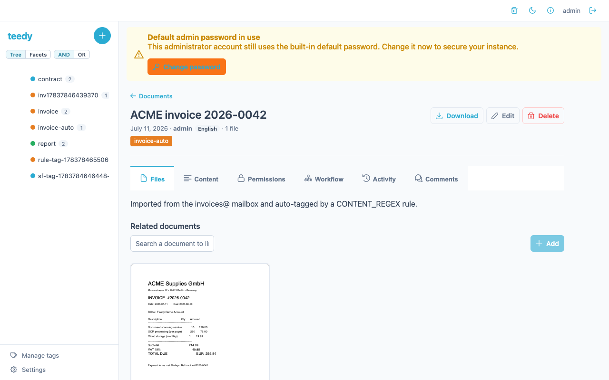

# Cookbook

End-to-end recipes that wire Teedy's features together. Each recipe lists what you
need up front, then walks through the setup step by step and links to the reference
pages for the details. Every step here uses a capability Teedy already has — nothing
is aspirational.

- [1. Automated invoice intake](#1-automated-invoice-intake)
- [2. EU-compliant self-hosted setup](#2-eu-compliant-self-hosted-setup)
- [3. Scanned-paper archive](#3-scanned-paper-archive)
- [4. Team document review](#4-team-document-review)
- [5. Scripted ingestion via API key](#5-scripted-ingestion-via-api-key)
- [6. Directory-of-record lifecycle](#6-directory-of-record-lifecycle)

---

## 1. Automated invoice intake

Capture invoices by email, tag them automatically, route them for approval, and
notify an external system when approval completes.

> **What you'll need**
> - Administrator access
> - A dedicated IMAP mailbox invoices are forwarded to
> - An external endpoint to receive the completion webhook



1. **Configure IMAP inbox scanning** so forwarded invoices become documents. In
   **Settings → Inbox**, set the mailbox connection and turn scanning on. See
   [Inbox scanning](inbox.md#enabling-and-configuring).
2. **Auto-tag the imports.** Create a content-based rule (e.g. `CONTENT_REGEX`
   matching `invoice`) in **Settings → Tag Rules** so the invoice attachments are
   tagged when they are processed. See
   [tag-match rules](tags-and-filtering.md#auto-tagging-tag-match-rules). (You can
   additionally set a blanket **Tag for imported documents** on the inbox.)
3. **Build an approval route model.** In **Settings → Workflows**, create an
   *Invoice Approval* model with the steps you need (for example a `VALIDATE`
   accounting check followed by an `APPROVE` manager decision). See
   [building a route model](workflows.md#building-a-route-model).
4. **Start the route — manually.** There is **no automatic trigger**: importing or
   tagging a document does **not** start a workflow. A user with `WRITE` on the
   document (and `READ` on the model) starts the *Invoice Approval* route on it from
   the document view. See the [route lifecycle](workflows.md#lifecycle), step 2.
5. **Notify an external system on completion.** Register a webhook for the
   `ROUTE_COMPLETED` event in **Settings → Webhooks**; when an invoice route
   finishes, Teedy POSTs to your endpoint. See
   [webhooks](admin-guide.md#webhooks) and the
   [route webhook events](workflows.md#webhooks).

Cross-links: [Inbox scanning](inbox.md) · [Tags & filtering](tags-and-filtering.md)
· [Workflows](workflows.md) · [Admin guide](admin-guide.md#webhooks)

---

## 2. EU-compliant self-hosted setup

Run Teedy entirely on your own infrastructure behind single sign-on, with per-user
quotas and no anonymous access.

> **What you'll need**
> - Administrator access to Teedy and your reverse proxy
> - An OIDC provider (e.g. Authelia)
> - A backup target (database + file storage)

1. **Put Teedy behind OIDC/Authelia.** Configure the OIDC provider so browser
   sessions are authenticated by your IdP; accounts are auto-provisioned on first
   login. See [Authentication → OIDC/SSO](authentication.md).
2. **Cap storage with a global quota.** Set `DOCS_GLOBAL_QUOTA` to a default
   per-user byte limit. This default applies to OIDC-provisioned users too, so
   users created at first SSO login start with a quota. See
   [Users and quotas](admin-guide.md#users-and-quotas) and
   [configuration → General](configuration.md#general).
3. **Turn guest login off.** So nothing is browsable without signing in, disable
   guest login. See [guest access](sharing-and-permissions.md#guest-access).
4. **Set up a verified backup.** Files are AES-encrypted on disk and are useless
   without the database, and vice versa — back up **both together** and verify by
   restoring into a scratch environment. See
   [data directory and backup](configuration.md#data-directory-and-backup).

> **Footer links** for a data-retention / imprint page in the UI footer are
> *coming in v3.4* and are not present in the current release.

Cross-links: [Authentication](authentication.md) · [Admin guide](admin-guide.md) ·
[Sharing & permissions](sharing-and-permissions.md) · [Configuration](configuration.md)

---

## 3. Scanned-paper archive

Digitize a paper archive: OCR everything, fix sideways scans, organize with nested
tags, and find documents fast.

> **What you'll need**
> - Administrator access (to set the OCR language)
> - Scanned PDFs or images to import

1. **Set the OCR language.** Set `DOCS_DEFAULT_LANGUAGE` to the language of your
   documents so uploaded images and PDFs are OCR'd into searchable text. See
   [configuration → Language / OCR](configuration.md#language--ocr) and
   [Admin guide → SMTP and OCR](admin-guide.md#smtp-and-ocr).
2. **Straighten crooked scans.** When a page came in sideways, use the viewer's
   rotate controls — a **view-only** adjustment that doesn't alter the stored file.
   See [viewing and rotation](documents.md#viewing-and-rotation).
3. **Organize with nested tags.** Build a hierarchy such as `Finance › Invoices ›
   2026`; filtering by a parent tag also matches documents under its children. See
   [tags](tags-and-filtering.md#tags).
4. **Save the views you return to.** Once a filter combination is useful, store it
   as a [saved filter](tags-and-filtering.md#saved-filters) and re-apply it in one
   click.
5. **Search across the OCR'd text.** Use `full:` to search inside file content, not
   just titles and metadata (e.g. `full:invoice after:2026-01-01`). See
   [search syntax](tags-and-filtering.md#search-syntax).

Cross-links: [Configuration](configuration.md) · [Documents](documents.md) ·
[Tags & filtering](tags-and-filtering.md)

---

## 4. Team document review

Give a team shared access through groups, inherit permissions from tags, relate and
discuss documents, and run a two-step approval.

> **What you'll need**
> - Administrator access
> - The users who will participate

1. **Model the team with hierarchical groups.** Create groups (optionally nested
   with a parent) so you can grant access to many people at once. See
   [groups](sharing-and-permissions.md#groups).
2. **Grant access via tag ACLs.** Put an ACL on a **tag** and it flows down to every
   document carrying that tag, appearing as `inherited_acls` on those documents —
   grant a group `READ` (or `WRITE`) on a project tag and the whole team can see the
   project's documents. See
   [inherited permissions from tags](sharing-and-permissions.md#inherited-permissions-from-tags).
3. **Link related documents.** Use [relations](documents.md#relations) to connect,
   say, a contract and its amendments so reviewers can navigate between them.
4. **Discuss in comments.** Reviewers leave [comments](sharing-and-permissions.md)
   on a document (anyone with `READ` can view them).
5. **Run a two-step route.** Create a route model with a `VALIDATE` step (a team
   sign-off) followed by an `APPROVE` step (a manager's accept/reject), then start
   it on the document. See [building a route model](workflows.md#building-a-route-model)
   and the [route lifecycle](workflows.md#lifecycle).

Cross-links: [Sharing & permissions](sharing-and-permissions.md) ·
[Documents](documents.md) · [Workflows](workflows.md)

---

## 5. Scripted ingestion via API key

Push documents into Teedy from a script — create the document, attach a file, and
let rules and metadata do the rest.

> **What you'll need**
> - An API key (Settings → API Keys)
> - A script or `curl`

1. **Create an API key.** In **Settings → API Keys**, create a key; it acts as the
   creating user with exactly that user's permissions, and the raw key is shown only
   once. See [REST API → API key](api.md#api-key-recommended-for-scripts).
2. **Create the document (call 1 of 2).** `PUT /api/document` with at least `title`
   and `language` returns the new document's ID.
   ```bash
   curl -X PUT https://teedy.example.com/api/document \
     -H "Authorization: Bearer tdapi_<your-key>" \
     -d "title=Invoice 2026-001" \
     -d "language=eng"
   ```
3. **Attach a file (call 2 of 2).** `PUT /api/file` (multipart) uploads a file to
   that document. Uploading and creating a document are **two separate calls** — the
   document first, then each file referencing it.
   ```bash
   curl -X PUT https://teedy.example.com/api/file \
     -H "Authorization: Bearer tdapi_<your-key>" \
     -F "id=<document-id>" \
     -F "file=@invoice.pdf"
   ```
4. **Let tag-match rules tag it.** When the uploaded file is processed, any matching
   [tag-match rules](tags-and-filtering.md#auto-tagging-tag-match-rules) apply their
   tags automatically — no extra call needed.
5. **Attach metadata.** Pair each custom field's `metadata_id` with a
   `metadata_value` on the document create/update call to populate custom fields. See
   [documents → metadata](documents.md#metadata).

Cross-links: [REST API](api.md) · [Tags & filtering](tags-and-filtering.md) ·
[Documents](documents.md)

---

## 6. Directory-of-record lifecycle

Treat Teedy as a system of record: tune retention, take a portable export, and
prove your backup actually restores.

> **What you'll need**
> - Administrator access
> - A scratch environment for a restore test

1. **Tune trash retention.** Set `DOCS_TRASH_RETENTION_DAYS` to your retention
   window, or `0` to disable auto-purge entirely so nothing is ever removed
   automatically. See [trash / recycle bin](documents.md#trash--recycle-bin) and
   [configuration → Trash](configuration.md#trash).
2. **Take a full-account export.** `GET /api/document/export` streams a ZIP of every active (non-trashed)
   document you own with a `manifest.json`, subject to the `DOCS_EXPORT_*` caps. See
   [exporting documents](documents.md#whole-account-to-zip). Each export is recorded
   in the [audit log](admin-guide.md#audit-log).
3. **Back up database and files together,** then **verify by restoring into a
   scratch database and storage directory** before relying on the backup — an
   untested backup is not a backup. See
   [data directory and backup](configuration.md#data-directory-and-backup).

Cross-links: [Documents](documents.md) · [Configuration](configuration.md) ·
[Admin guide](admin-guide.md#audit-log)

---

## See also

- [Getting started](getting-started.md) — the minimal setup these recipes build on
- [Documents](documents.md) · [Tags & filtering](tags-and-filtering.md) ·
  [Workflows](workflows.md) · [Inbox scanning](inbox.md) ·
  [Sharing & permissions](sharing-and-permissions.md) · [REST API](api.md)
