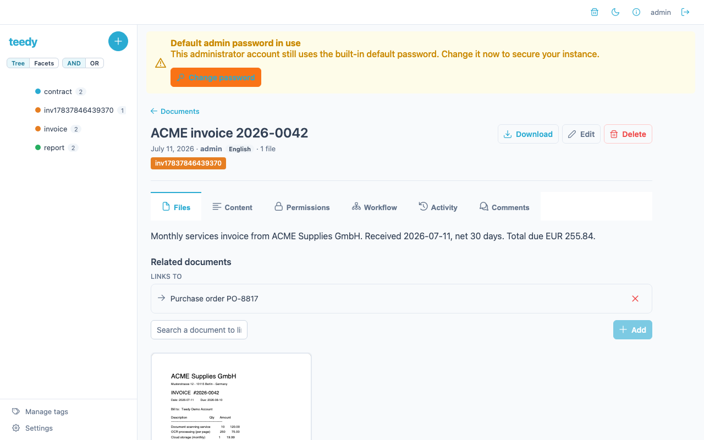
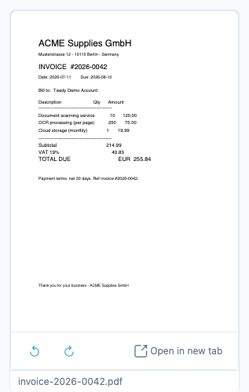
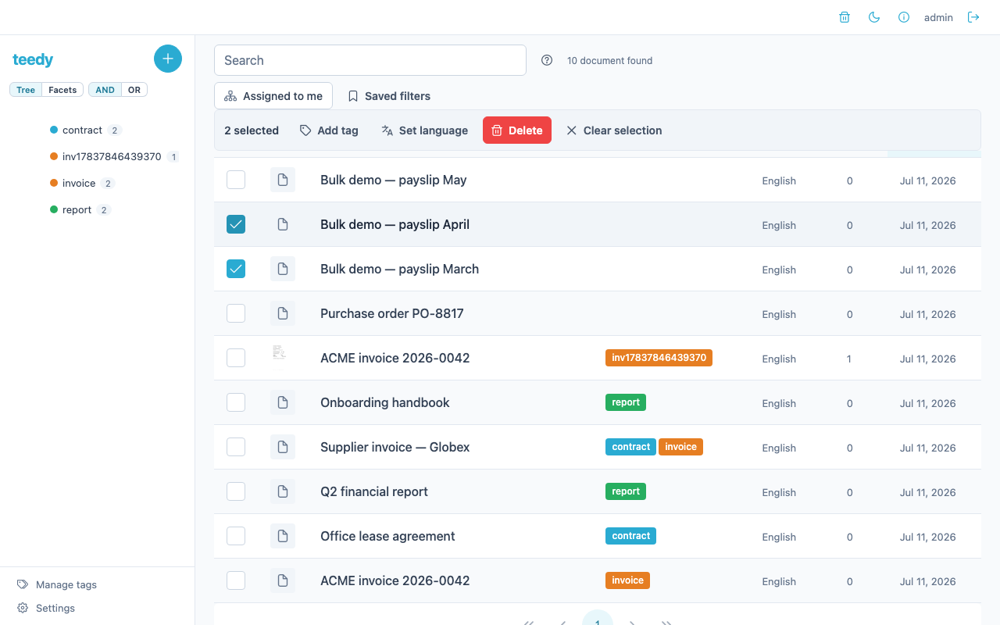
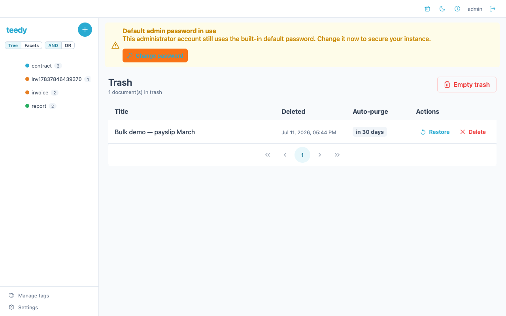

# Documents

A document in Teedy is a container: a title, Dublin Core and custom metadata, and
one or more attached files (PDFs, images, Office files, video). This page covers
the document lifecycle beyond simple upload — file versions, relations, viewer
rotation, custom metadata, and the trash.

## Files and versions

A document holds one or more files. When you upload a replacement for an existing
file, Teedy keeps the old copy as a **version** rather than overwriting it, so you
always have the history of a file.

- Upload a new version by uploading a file with `PUT /api/file` and referencing the
  file it replaces (`previousFileId`). The new upload becomes the current version;
  the previous one is retained in the version chain.
- List a file's versions with `GET /api/file/{id}/versions` — it returns every file
  in the same version chain, oldest to newest.

To "revert", upload the older file's content as a new version — the version chain
always moves forward, so the restored copy becomes the new current version.

## Relations

Relations link two documents together (for example an invoice and its matching
purchase order). A relation is directional: from the document you edit, the other
document is either the source or the target of the link.

Edit relations from the document's edit view: search for the other document by
title and add it. Relations round-trip through the document API as a `relations`
form parameter (a list of related document IDs) on document create/update, and are
returned on `GET /api/document/{id}` as an array with each related document's `id`,
`title`, and whether it is the `source` of the relation.

## Viewing and rotation

The built-in viewer renders PDFs and images inline. When a scan comes in sideways,
rotate it in the viewer with the rotate-left and rotate-right controls — each press
turns the view 90°.

Rotation is a **view-only** adjustment: it changes how the page is displayed in
your current session and is not written back to the stored file. Reopening the
document shows it in its original orientation.

## Bulk operations

The document list supports **multi-select**: tick the checkboxes on several
documents and a bulk-action bar appears with actions that apply to all selected
documents at once.

| Action | Effect |
|--------|--------|
| **Add tag** | Adds one tag to every selected document, preserving each document's existing tags |
| **Set language** | Sets the OCR/display language on every selected document |
| **Delete** | Moves every selected document to the [trash](#trash--recycle-bin) |
| **Clear selection** | Deselects everything |

Teedy has **no server-side bulk endpoint** — each bulk action **fans out into one
API call per document** against the ordinary single-document endpoints. A progress
bar shows how many of the selected documents have been processed, and one failing
document (for example one you lack `WRITE` on) does not abort the rest: the failures
are reported separately from the successes.

## Exporting documents

Teedy can export documents in two ways.

### One document to PDF

`GET /api/document/{id}/pdf` renders a single document — its files combined — into a
PDF. It requires `READ` permission on the document (or a valid share link via the
`share` query parameter). Optional query parameters:

| Parameter | Effect |
|-----------|--------|
| `metadata` | If `true`, includes the document's metadata in the PDF |
| `fitimagetopage` | If `true`, scales images to fit the page |
| `margin` | Page margin in millimetres |

### Whole account to ZIP

`GET /api/document/export` streams a ZIP archive of **every active document you
own** (scoped by creator, so it never includes another user's documents; trashed
documents are excluded — restore anything that must be included first), with each
document's files in a per-document folder plus a `manifest.json` describing them.
It requires an authenticated user and is subject to server-side guardrails:

| Env variable | Effect | Default |
|--------------|--------|---------|
| `DOCS_EXPORT_ENABLED` | Master switch; `false` disables the endpoint (returns `ExportDisabled`) | `true` |
| `DOCS_EXPORT_MAX_DOCUMENTS` | Rejects the export up front if you own more than this many documents (`ExportTooLarge`) | `10000` |
| `DOCS_EXPORT_MAX_CONCURRENT` | Caps simultaneous exports; over the cap returns `503` with a `Retry-After` hint | `2` |

See [configuration](configuration.md#export) for these knobs. Each export is
recorded in the [audit log](admin-guide.md#audit-log).

## Metadata

Every document carries Dublin Core metadata plus any **custom metadata fields** an
admin has defined. Custom fields have a type that controls their input:

| Type | Input |
|------|-------|
| `STRING` | Text box |
| `INTEGER` | Whole number |
| `FLOAT` | Decimal number |
| `DATE` | Date picker |
| `BOOLEAN` | Checkbox |
| `VOCABULARY` | Dropdown backed by a [vocabulary](vocabulary.md) |

Admins define custom fields under **Settings → Metadata** (`/api/metadata`
CRUD: `GET`, `PUT` to create, `POST /api/metadata/{id}` to update,
`DELETE /api/metadata/{id}`). On a document, values are set by pairing each
field's `metadata_id` with its `metadata_value`. See
[vocabulary](vocabulary.md#worked-example--a-document-type-dropdown) for a worked
dropdown example.

## Trash / recycle bin

Deleting a document is a **soft delete** — it moves to the trash, not oblivion, so
an accidental delete is always recoverable until it is purged.

| Action | Request |
|--------|---------|
| Delete a document (to trash) | `DELETE /api/document/{id}` |
| List trashed documents | `GET /api/document/trash` |
| Restore from trash | `POST /api/document/{id}/restore` |
| Permanently delete one document | `DELETE /api/document/{id}/permanent` |
| Empty the whole trash | `DELETE /api/document/trash` |

Trashed documents are also **auto-purged** after a retention window. Set
`DOCS_TRASH_RETENTION_DAYS` (default `30`) to control it; `0` disables auto-purge
so nothing is ever purged automatically. A background service checks roughly every
hour and purges anything older than the window.

## Activity

Each document has an **Activity** tab showing that document's history — the
audit-log entries scoped to it. Each row lists the timestamp, the user who acted,
and a description of the action (created, updated, ACL changed, and so on). It reads
from `GET /api/auditlog?document={id}`, giving a per-document view of the same trail
the admin-wide [audit log](admin-guide.md#audit-log) records globally.

## See also

- [Tags & filtering](tags-and-filtering.md) — organizing and finding documents
- [Vocabulary](vocabulary.md) — dropdown-backed metadata fields
- [Sharing & permissions](sharing-and-permissions.md) — who can read/write a document
- [Workflows](workflows.md) — approval routes on a document
