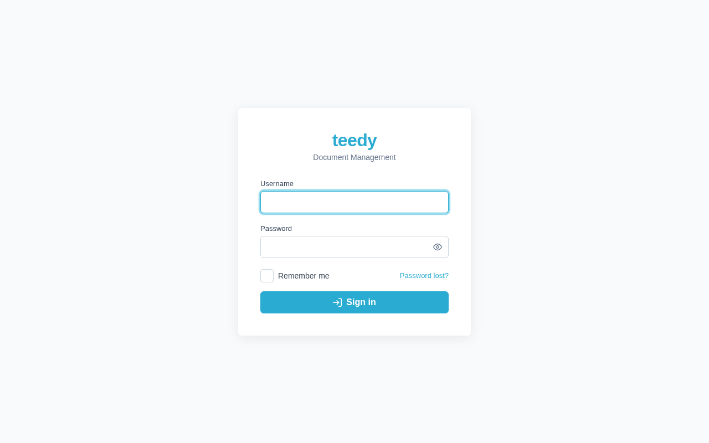

# Getting started

This walks you from nothing to a running Teedy instance with a secured admin
account. For the full configuration reference see [configuration](configuration.md).

Teedy ships as a preconfigured Docker image (with OCR and media-conversion tools
built in) listening on port `8080`. The data directory is `/data` — always mount a
volume on it.

- Latest stable image: `ghcr.io/fmaass/teedy-docs:v3.3.0`
- Development (main branch, may be unstable): `ghcr.io/fmaass/teedy-docs:latest`

## Quick start — testing (embedded H2)

If you provide no database configuration, Teedy uses an embedded H2 database. **Use
this only for testing** — for production use PostgreSQL (below).

```yaml
services:
  teedy-server:
    image: ghcr.io/fmaass/teedy-docs:v3.3.0
    restart: unless-stopped
    ports:
      - 8080:8080
    environment:
      DOCS_BASE_URL: "https://docs.example.com"
      DOCS_ADMIN_EMAIL_INIT: "admin@example.com"
      DOCS_ADMIN_PASSWORD_INIT: "$$2a$$05$$PcMNUbJvsk7QHFSfEIDaIOjk1VI9/E7IPjTKx.jkjPxkx2EOKSoPS"
      DOCS_MAX_UPLOAD_SIZE: "524288000"
    volumes:
      - ./docs/data:/data
```

Start it:

```bash
docker compose up -d
```

## Recommended — production (PostgreSQL)

For production, run PostgreSQL and point Teedy at it with `DATABASE_URL`:

```yaml
services:
  teedy-server:
    image: ghcr.io/fmaass/teedy-docs:v3.3.0
    restart: unless-stopped
    ports:
      - 8080:8080
    environment:
      DOCS_BASE_URL: "https://docs.example.com"
      DOCS_ADMIN_EMAIL_INIT: "admin@example.com"
      DOCS_ADMIN_PASSWORD_INIT: "$$2a$$05$$PcMNUbJvsk7QHFSfEIDaIOjk1VI9/E7IPjTKx.jkjPxkx2EOKSoPS"
      DOCS_MAX_UPLOAD_SIZE: "524288000"
      DATABASE_URL: "jdbc:postgresql://teedy-db:5432/teedy"
      DATABASE_USER: "teedy_db_user"
      DATABASE_PASSWORD: "teedy_db_password"
      # DATABASE_POOL_SIZE is intentionally unset: Teedy then sizes the connection pool from the
      # container's CPU count, so it always has enough connections for its own background workers.
      # Set it only to pin a value — e.g. when several instances share one PostgreSQL server.
    volumes:
      - ./docs/data:/data
    depends_on:
      - teedy-db

  teedy-db:
    image: postgres:17-alpine
    restart: unless-stopped
    expose:
      - 5432
    environment:
      POSTGRES_USER: "teedy_db_user"
      POSTGRES_PASSWORD: "teedy_db_password"
      POSTGRES_DB: "teedy"
    volumes:
      - ./docs/db:/var/lib/postgresql/data
```

> The example passwords are in cleartext to keep it readable. In practice, put
> secrets in an `.env` file or a secrets manager. `DOCS_ADMIN_PASSWORD_INIT` is a
> **bcrypt hash**, and each `$` in it must be escaped as `$$` in compose YAML.

## First login

1. Browse to your instance (e.g. `https://docs.example.com`).

   

2. Log in with the default credentials:

   | Field | Value |
   |-------|-------|
   | Username | `admin` |
   | Password | `admin` |

3. **Change the admin password immediately.** The default password is `admin` — do
   not leave it in place in production. Open **Settings → Account** and set a new
   password (or edit the `admin` user under **Settings → Users**).

If you set `DOCS_ADMIN_PASSWORD_INIT` to a bcrypt hash, the `admin` account starts
with that password instead — but only while it still holds the factory default;
once changed, that variable is ignored (it is a first-boot bootstrap, not a reset
lever). See [RECOVERY.md](../RECOVERY.md) for recovery paths.

## Next steps

- [Configuration](configuration.md) — every environment variable and `-D` property
- [Authentication](authentication.md) — set up OIDC/SSO, LDAP, or proxy auth
- [Documents](documents.md) — uploading, versioning, metadata, trash
- [Tags & filtering](tags-and-filtering.md) — organizing and finding documents
- [Admin guide](admin-guide.md) — users, quotas, webhooks, SMTP, OCR
