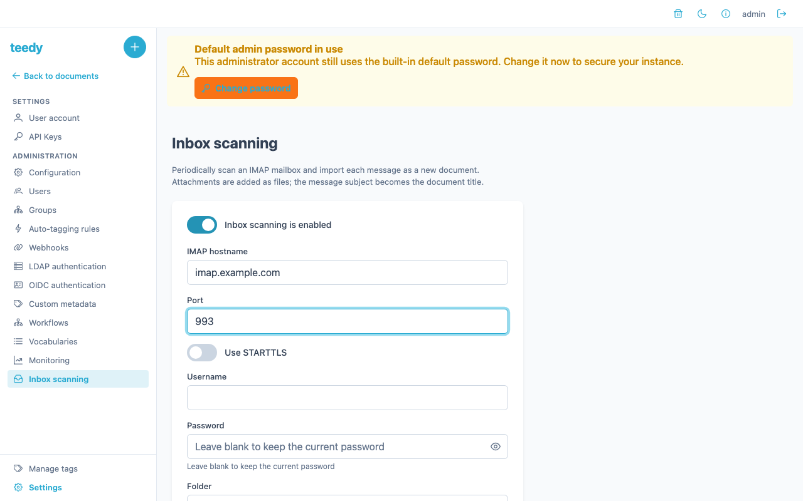

# Inbox scanning (IMAP import)

Teedy can watch an IMAP mailbox and turn each incoming email into a document
automatically. This is handy for capture-by-email workflows — forward a scan or an
invoice to a dedicated address and it lands in Teedy as a new document, with the
attachments as files. Scanning is **administrator-configured** and runs on a
background schedule.

## Enabling and configuring

Open **Settings → Inbox** as an administrator. Turn on **Inbox scanning** to reveal
the connection fields:

| Field | Meaning |
|-------|---------|
| **IMAP hostname** | The mail server to connect to |
| **Port** | The IMAP port. Port **`993` selects implicit SSL/IMAPS**; any other port uses a plain connection (optionally upgraded by STARTTLS) |
| **Use STARTTLS** | Upgrade a plain connection to TLS after connecting (on by default) |
| **Username** | The mailbox login |
| **Password** | The mailbox password. **Write-only** — it is never sent back to the browser, so the field stays blank on reload; leave it blank to keep the stored password, or type a new one to replace it |
| **Folder** | The mailbox folder to scan (for example `INBOX`) |
| **Tag for imported documents** | Optional. Every imported document is given this tag |
| **Detect tags from the message** | When on, `#tag` tokens in the subject line are matched against existing tags and applied (see [Auto-tagging](#auto-tagging-from-the-subject) below) |
| **Delete messages after import** | When on, each message is removed from the mailbox once imported (see [Delete-after-import](#delete-after-import) below) |

Two buttons save the configuration:

- **Save** — persists the settings without connecting. Always available, so you can
  store settings for a disabled inbox.
- **Save & test connection** — saves, then immediately connects to the mailbox and
  reports how many **unread** messages it found. Because the test runs against the
  *saved* configuration, Teedy always saves first; a save failure is reported as a
  save error, a connection failure as a test error.

> **Note:** the test button reports the count of unread messages the scanner would
> pick up on its next run — it does not import them.

## How email becomes a document

The scanner runs on a fixed schedule (every minute) while scanning is enabled. On
each run it connects to the configured folder and processes every **unread**
(unseen) message:

- The **subject** becomes the document **title** (truncated to 100 characters). A
  message with no subject falls back to a default title.
- The **message body** becomes the document **description** (truncated to 4000
  characters), and the subject is also stored as the document **subject** field.
- The document **format** is recorded as `EML` and its **source** as `Inbox`.
- The document **language** is set to the server's default OCR language
  (`DOCS_DEFAULT_LANGUAGE`; see [configuration](configuration.md#language--ocr)).
- **Each attachment** on the email is added to the document as a **file**, so a
  scanned PDF forwarded by email is attached and (being a file) goes through the
  normal OCR and [tag-match-rule](tags-and-filtering.md#auto-tagging-tag-match-rules)
  pipeline.

### Who owns the imported document

Ownership is decided by the **sender's email address**: if the sender's address
matches a Teedy user's email, that user owns the document; otherwise it is owned by
the built-in `admin` account. This lets several users share one capture mailbox and
still land documents in their own accounts.

## Auto-tagging from the subject

When **Detect tags from the message** is enabled, the scanner scans the **subject
line** for `#`-prefixed tokens (for example `Invoice #finance #2026`). Each token
whose text exactly matches an existing tag's name applies that tag to the new
document, and the token is stripped from the resulting title. Tokens that do not
match an existing tag are ignored (they are not created).

This is independent of the **Tag for imported documents** field: if that tag is
set, it is applied to *every* imported document regardless of the subject, and both
sources of tags are combined.

> Auto-tagging from the subject matches tag **names** literally. It is separate from
> the content-based [tag-match rules](tags-and-filtering.md#auto-tagging-tag-match-rules),
> which run when the imported attachments are processed.

## Delete-after-import

- **Off (default):** an imported message is marked **read (seen)** so the scanner
  skips it next time, but it stays in the mailbox.
- **On:** an imported message is flagged for **deletion** and expunged from the
  mailbox when the scan cycle closes the folder. Use this to keep the capture
  mailbox from filling up — but note the original email is then gone from the
  server, so the Teedy document (with its attachments) becomes the only copy.

## See also

- [Tags & filtering](tags-and-filtering.md) — tags, nesting, and content-based
  tag-match rules
- [Documents](documents.md) — what a document is and how files attach to it
- [Configuration](configuration.md#language--ocr) — the default OCR language applied
  to imported documents
- [Admin guide](admin-guide.md) — the other administrator settings
