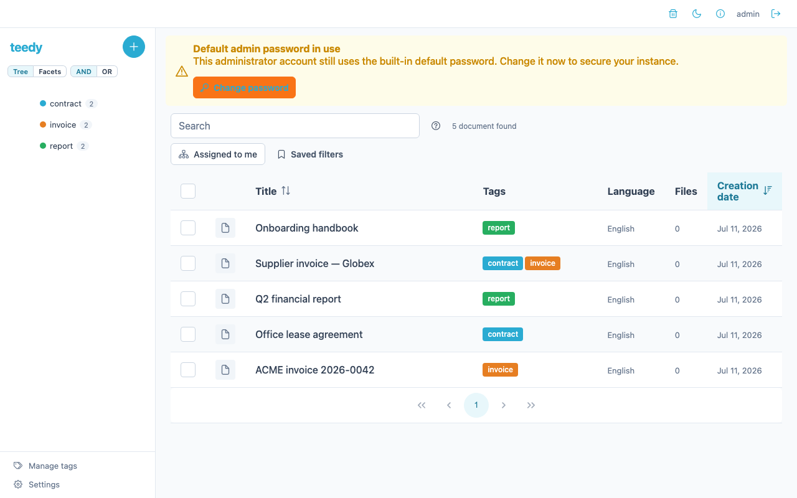
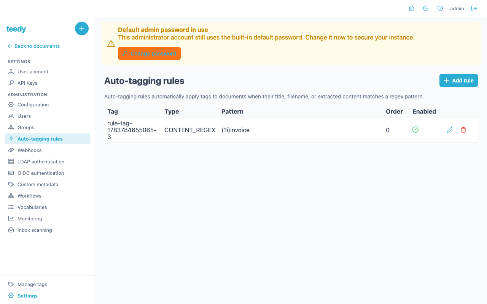
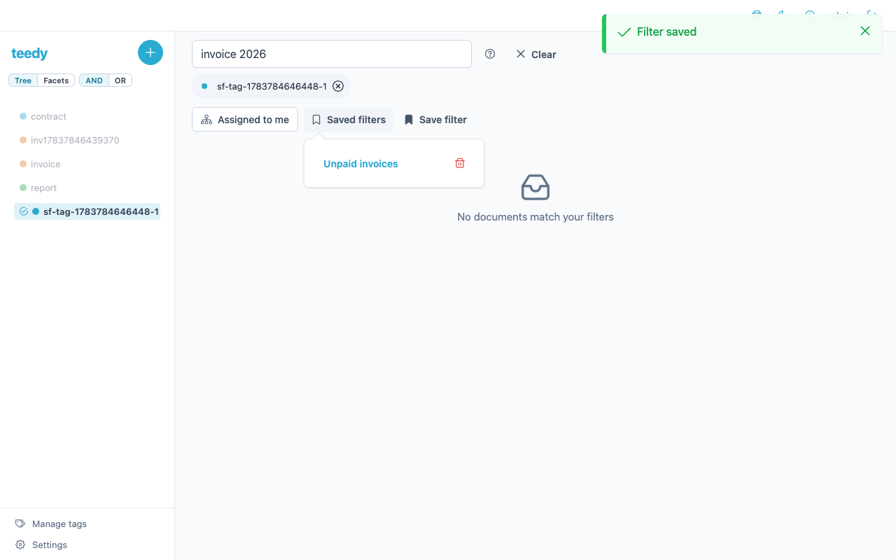

# Tags & filtering

Tags are Teedy's primary way to organize documents, and the search box is how you
find them again. This page covers tags (including nesting), the clickable tag chips
that filter with one click, admin auto-tagging rules, and the full search-query
syntax.

## Tags

A tag has a name and a color. Tags can be **nested**: each tag may have a parent
tag, forming a hierarchy (e.g. `Finance › Invoices › 2026`). Filtering by a parent
tag also matches documents under its children.

Create and edit tags in the tag sidebar or via the API:

| Action | Request |
|--------|---------|
| List tags | `GET /api/tag/list` |
| Create a tag | `PUT /api/tag` with form params `name`, `color`, `parent` |
| Update a tag | `POST /api/tag/{id}` with form params `name`, `color`, `parent` |
| Delete a tag | `DELETE /api/tag/{id}` |

`color` is a hex color (e.g. `#2aabd2`); `parent` is the parent tag's ID (omit for a
top-level tag). Teedy rejects a parent assignment that would create a cycle.

### Clickable tag chips

Tag chips shown on a document are clickable: clicking a chip filters the document
list down to that tag in one step. The click applies the tag as a **positive
filter** — it adds the tag to the active filter (and clears it from any exclusion),
then takes you to the filtered document list. Clicking the same tag again is
idempotent (it stays selected rather than toggling off), so chips are a fast way to
drill into a tag without hunting through the sidebar.

## Auto-tagging: tag-match rules

Tag-match rules let an admin apply a tag automatically when a document matches a
pattern — for example, tag anything whose filename looks like an invoice. Rules are
managed in **Settings → Tag Rules** (administrator only).

Each rule has:

| Field | Description |
|-------|-------------|
| **Tag** | The tag to auto-apply when the rule matches (`tag_id`) |
| **Rule type** | What text the pattern is tested against: `TITLE_REGEX`, `FILENAME_REGEX`, or `CONTENT_REGEX` |
| **Pattern** | A regular expression (validated on save) |
| **Order** | Execution order (default `0`) |
| **Enabled** | Whether the rule is active (default on) |

API: `GET`/`PUT /api/tagmatchrule`, `POST`/`DELETE /api/tagmatchrule/{id}`, and
`POST /api/tagmatchrule/test` to try a pattern against sample text before saving.

## Search syntax

The search box does full-text search by default, and supports typed operators for
precise filtering. Prefix a term with an operator and a colon:

| Operator | Matches | Example |
|----------|---------|---------|
| `tag:` | Documents with the named tag (and its children) | `tag:invoice` |
| `!tag:` | Documents **without** the named tag | `!tag:archived` |
| `after:` | Created on/after a date (`yyyy`, `yyyy-MM`, or `yyyy-MM-dd`) | `after:2026-01-01` |
| `before:` | Created on/before a date | `before:2026-12-31` |
| `at:` | Created on an exact day / month / year | `at:2026-03` |
| `uafter:` | Updated on/after a date | `uafter:2026` |
| `ubefore:` | Updated on/before a date | `ubefore:2026-06` |
| `uat:` | Updated on an exact day / month / year | `uat:2026-03-15` |
| `shared:` | Whether the document is shared (`yes` / `no`) | `shared:yes` |
| `lang:` | Documents in a language (ISO 639-3) | `lang:fra` |
| `mime:` | Files of a MIME type | `mime:image/png` |
| `by:` | Documents created by a user (exact username) | `by:jsmith` |
| `workflow:` | Documents with a pending workflow step for you (`me`) | `workflow:me` |
| `title:` | Exact title match — the whole value is one title (no comma splitting); repeat the operator to match any of several titles | `title:Invoice` |
| `simple:` | Search simple fields only (not file content) | `simple:invoice` |
| `full:` | Full-text search including file content | `full:invoice` |
| *(no prefix)* | Full-text search | `invoice` |

Operators combine — `tag:invoice after:2026-01-01 !tag:paid` finds unpaid invoices
created this year. Multiple `tag:`/`!tag:` terms are ANDed together.

## Saved filters

A filter in Teedy lives entirely in the URL — the active tags, exclusions, view
mode, search text, and workflow filter are all query parameters. **Saved filters**
let you name a filter combination and re-apply it in one click, instead of
bookmarking the URL by hand.

From the search bar:

- **Save the current filter** — when any filter dimension is active, a **Save
  filter** button appears. Give the combination a name and it is stored against
  your account.
- **Re-apply a saved filter** — open the **Saved filters** dropdown and click a
  name; the document list navigates to exactly that filter combination.
- **Delete a saved filter** — click the trash icon next to a name in the dropdown.
  Deletion is permanent (there is no trash for saved filters).

### What gets saved

Only the document-list filter dimensions are stored, captured verbatim from the
URL query — the URL is the source of truth:

| Query key | Filter |
|-----------|--------|
| `tags` | Included tags |
| `exclude` | Excluded tags |
| `mode` | Tree-vs-facet view mode |
| `search` | Search-box text |
| `workflow` | Pending-workflow filter |

Any other query parameter is dropped. A workflow-only filter is saveable.

### Constraints

- Saved filters are **per-user** — they are never shared between accounts, and one
  user can never see or delete another's.
- The name must be **1–100 characters** and **unique per user** (case-insensitive):
  saving a duplicate name returns an `AlreadyExistingFilter` error.
- The stored query string is **1–2000 characters**; it must contain only the five
  keys above, with no repeated key and no empty query component (a leading,
  trailing, or doubled `&`); empty *values* such as `search=` are accepted.
  Otherwise the save is rejected
  with a `ValidationError`.

### API

| Action | Request |
|--------|---------|
| List your saved filters | `GET /api/savedfilter` |
| Create a saved filter | `PUT /api/savedfilter` with form params `name`, `query` |
| Delete a saved filter | `DELETE /api/savedfilter/{id}` |

`query` is the URL-encoded filter query string (e.g. `tags=<id>&mode=facet`).
Listing returns each filter's `id`, `name`, `query`, and `create_date`. A `DELETE`
for an unknown or another user's filter returns `404` — the API never confirms the
existence of a filter you do not own.

## See also

- [Documents](documents.md) — the documents these tags organize
- [Admin guide](admin-guide.md) — tag rules and other admin settings
- [Sharing & permissions](sharing-and-permissions.md) — tag-based ACL inheritance
