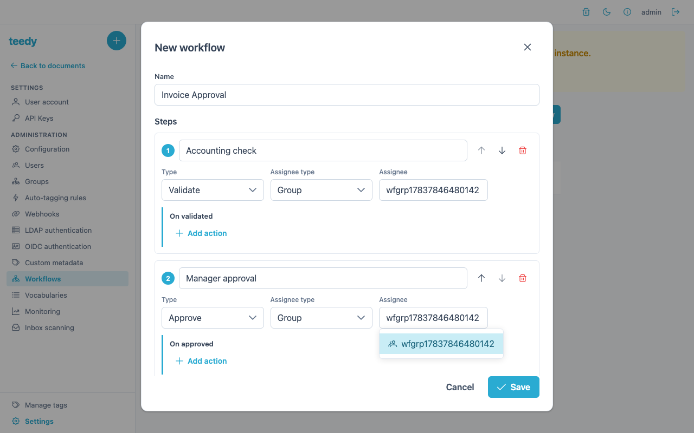
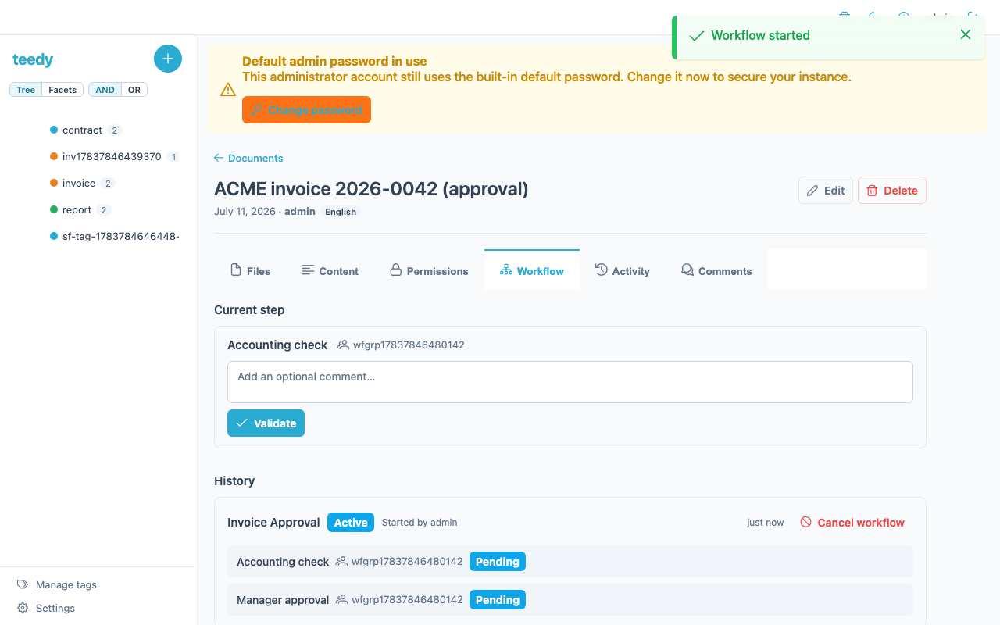

# Workflows (approval routes)

Workflows let you attach a document-approval pipeline to a document: an ordered
list of steps, each assigned to a user or a group, that must be worked through
before the document is considered approved. Use them when a document needs a
sign-off chain — an invoice that accounting checks and a manager approves, or an
intake form that a registry validates before filing.

A workflow has two halves:

- A **route model** is the reusable template — the ordered steps and who they are
  assigned to. Only an administrator can create route models.
- A **route** is a running instance of a model on one specific document. Any user
  who can write the document (and read the model) can start one.

## Concepts

### Steps and step types

Each step in a model targets exactly one **user** or one **group**, and has one of
two types:

| Step type | Meaning | Possible outcomes |
|-----------|---------|-------------------|
| `VALIDATE` | A simple validation with no choice — the assignee confirms and the route moves on | `VALIDATED` |
| `APPROVE` | An accept/reject decision | `APPROVED` (advance) or `REJECTED` (halt) |

These are the only two step types. There is **no `SHARE` step type**. `SHARE` is a
*target type* used elsewhere in Teedy (for share links), and the route-model
validator explicitly rejects it if it appears as a step target — a model whose
step targets a `SHARE` is refused. Assign steps to a `USER` or a `GROUP` only.

### Transitions and route status

When an assignee acts on a step, the step records a **transition**:

| Transition | Produced by |
|------------|-------------|
| `VALIDATED` | A `VALIDATE` step — the only transition it accepts |
| `APPROVED` | The accept side of an `APPROVE` step |
| `REJECTED` | The reject side of an `APPROVE` step |

The transition must match the step type: a `VALIDATE` step accepts only
`VALIDATED`, and an `APPROVE` step accepts only `APPROVED` or `REJECTED`. Any
other combination is rejected as an invalid transition.

The route itself carries a status:

| Route status | Meaning |
|--------------|---------|
| `ACTIVE` | Still has steps left to work through |
| `DONE` | Every step completed successfully |
| `REJECTED` | An `APPROVE` step was rejected — the route halted |
| `CANCELLED` | A user with write access to the document cancelled the running route |

## Lifecycle

1. **An administrator creates a route model** (admin-only). The model holds the
   ordered steps and their targets.
2. **A user starts a route** on a document. The user needs `WRITE` permission on
   the document and `READ` permission on the model.
3. **The assigned user (or a member of the assigned group) acts** on the current
   step — validating, approving, or rejecting it, optionally with a comment.
4. **On acceptance**, the route advances to the next step, or completes (`DONE`)
   if that was the last step.
5. **On rejection**, the whole route halts immediately (status `REJECTED`) and the
   user who started the route is emailed to tell them the document was rejected.
   Later steps are never reached.

### Webhooks

Three webhook events fire over the lifecycle of a route (see the
[admin guide](admin-guide.md#webhooks) for how to register a webhook):

- `ROUTE_STARTED` — a route is started on a document
- `ROUTE_STEP_TRANSITIONED` — a step was validated, approved, or rejected
- `ROUTE_COMPLETED` — the route finished (`DONE`)

## Building a route model

Route models are edited in **Settings → Workflows** (administrator only). The
editor lets you name the model and add an ordered list of steps; each step needs a
name, a type (`VALIDATE` or `APPROVE`), and a target (a user or a group).



### The steps wire format

Under the hood, the model's steps are stored as a JSON array (max 5000
characters) sent as the `steps` form parameter on `PUT /api/routemodel`:

```json
[
  {
    "name": "Accounting Check",
    "type": "VALIDATE",
    "target": { "type": "GROUP", "name": "accounting" },
    "transitions": [
      { "name": "VALIDATED", "actions": [] }
    ]
  },
  {
    "name": "Manager Approval",
    "type": "APPROVE",
    "target": { "type": "USER", "name": "jsmith" },
    "transitions": [
      { "name": "APPROVED", "actions": [] },
      { "name": "REJECTED", "actions": [] }
    ]
  }
]
```

`target.type` is `USER` or `GROUP` (never `SHARE`), and `target.name` is the
username or group name.

## Sample workflows

### Sample A — two-step invoice approval

A group checks the invoice, then a named manager signs off.

| # | Step name | Type | Target |
|---|-----------|------|--------|
| 1 | `Accounting Check` | `VALIDATE` | group `accounting` |
| 2 | `Manager Approval` | `APPROVE` | user `jsmith` |

A member of `accounting` validates the invoice; the route then advances to
`jsmith`, who can approve (route → `DONE`) or reject (route → `REJECTED`, and the
initiator is emailed).

### Sample B — one-step intake validation

A single group validates incoming documents before they are filed.

| # | Step name | Type | Target |
|---|-----------|------|--------|
| 1 | `Registry Check` | `VALIDATE` | group `registry` |

A member of `registry` validates the document, and the route completes (`DONE`).

## Running a route on a document

1. Open a document you can write and go to its **Workflow** tab.
2. Choose a route model and start the route.

   

3. The assignee (or a member of the assigned group) opens the same tab and acts on
   the current step: **Validate** for a `VALIDATE` step, or **Approve** / **Reject**
   for an `APPROVE` step, optionally leaving a comment.

   

### API reference

The route API uses `application/x-www-form-urlencoded` bodies:

| Action | Request |
|--------|---------|
| Start a route | `POST /api/route/start` with form params `routeModelId`, `documentId` |
| Act on the current step | `POST /api/route/validate` with form params `documentId`, `transition`, `comment`, `routeStepId` |
| Read a document's route history | `GET /api/route?documentId=<id>` |
| Cancel a running route | `DELETE /api/route?documentId=<id>` |
| Create / update a model (admin) | `PUT /api/routemodel` with form params `name`, `steps` |

Cancellation follows the document's ACL: any user with `WRITE` permission on the
document can cancel its running route — no admin role or initiator status is
required. Cancelling marks the route `CANCELLED` and keeps its history listable.

Example — start the invoice-approval route on a document:

```bash
curl -X POST https://teedy.example.com/api/route/start \
  -H "Authorization: Bearer tdapi_<your-key>" \
  -d "routeModelId=<model-id>" \
  -d "documentId=<document-id>"
```

Example — a manager approves the pending step:

```bash
curl -X POST https://teedy.example.com/api/route/validate \
  -H "Authorization: Bearer tdapi_<your-key>" \
  -d "documentId=<document-id>" \
  -d "routeStepId=<step-id>" \
  -d "transition=APPROVED" \
  -d "comment=Looks good"
```

## See also

- [Vocabulary](vocabulary.md) — controlled value lists for metadata fields
- [Sharing & permissions](sharing-and-permissions.md) — the groups you assign steps to
- [Admin guide](admin-guide.md#webhooks) — registering webhooks for route events
